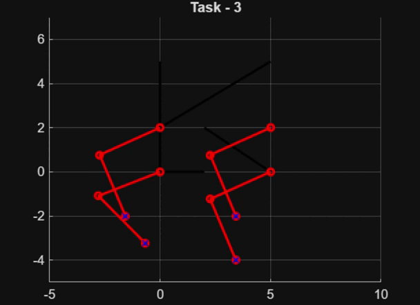

# Quadruped

## Objective
The objective of this project was to design and develop a **functional quadruped robot from scratch**, with a strong emphasis on **understanding and applying fundamental robotics concepts** rather than relying on pre-built platforms. The goal was to gain hands-on experience across the full pipeline of robotics development—from mathematical modeling and control theory to mechanical design, fabrication, and embedded implementation—culminating in a quadruped capable of **standing stably and walking in a straight line using a crawl gait**.

---

## Mathematical Foundations & Robotics Concepts
Before any physical design or implementation, significant effort was dedicated to building a solid mathematical foundation essential for legged robotics.

Key topics studied and applied include:
- **Forward Kinematics (FK):** Modeling the position of the end-effector (foot) given joint parameters and link lengths.
- **Inverse Kinematics (IK):** Computing joint angles required to place the foot at a desired position in Cartesian space.
- **Coordinate Frames & Transformations:** Defining link frames, joint frames, and transforming between coordinate spaces.

  

In parallel, we studied **control systems and their mathematical tools**, including:
- System modeling and response analysis
- **Laplace transforms** for understanding system behavior
- Stability concepts and response characteristics
- **PID control theory**, focusing on how proportional, integral, and derivative terms influence system response

This theoretical groundwork guided all subsequent design and implementation decisions.

---

## Control Systems & Gait Simulation (MATLAB)
Using the mathematical models developed for the leg kinematics, we simulated **basic quadruped gait patterns in MATLAB**.

This phase involved:
- Defining foot trajectories in Cartesian space
- Converting trajectories to joint-space commands using inverse kinematics
- Testing timing sequences for a **crawl gait**, ensuring static stability
- Observing joint angle continuity and avoiding singular configurations

  

MATLAB simulations allowed rapid experimentation with gait parameters and helped validate the feasibility of the chosen leg geometry and motion strategy before moving to hardware.

---

## Mechanical Design & 3D Modeling
Once the kinematic and control foundations were established, we transitioned to mechanical design using **Fusion 360**.

Key design decisions included:
- Modeling the **entire quadruped from scratch**, including legs, joints, and body
- Using **linear actuation for the lower leg link** to:
  - Reduce torque requirements on the shoulder servos
  - Improve mechanical efficiency and load distribution
 

  

  
- Designing a **compact and enclosed body** to house all essential components:
  - Battery
  - Arduino Uno
  - PCA9685 servo driver
  - Power distribution and auxiliary electronics
- Routing all wiring **internally**, ensuring no cables were exposed externally for improved aesthetics, safety, and reliability

The design was iterated multiple times to balance strength, weight, and manufacturability.

---

## Fabrication & Assembly
All mechanical parts were **3D printed using PLA**, followed by full mechanical assembly.

Hardware components used include:
- **MG995 servo motors** for actuation
- Arduino Uno for control logic
- PCA9685 for multi-servo control
- Battery and power regulation components

  

Care was taken to ensure:
- Proper servo alignment
- Smooth joint motion
- Structural rigidity under load

---

## Embedded Implementation & Final Result
Gait control algorithms developed during the simulation phase were implemented on the **Arduino platform**.

This involved:
- Translating joint trajectories into servo commands
- Synchronizing leg motion for a crawl gait
- Incremental testing and tuning to achieve stable motion

  

After full assembly and software integration, the quadruped was able to:
- **Stand stably**
- **Execute a crawl gait**
- **Walk in a straight line with controlled leg coordination**

---

## Outcome
This project provided end-to-end exposure to **legged robotics**, combining mathematics, control theory, mechanical design, simulation, and embedded systems. The final quadruped serves as a proof-of-concept platform and a foundation for future work such as improved gait generation, feedback control, and higher-level autonomy.

---

## Future Scope
- Closed-loop control using sensors
- More dynamic gaits (trot, pace)
- ROS integration and simulation in Gazebo
- Improved mechanical efficiency and weight reduction
